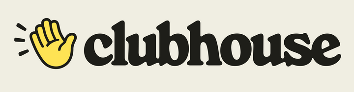
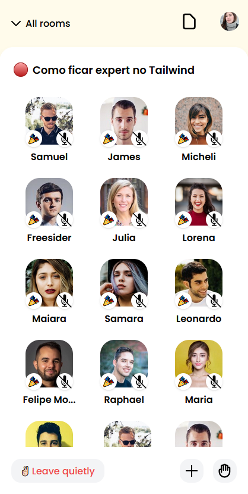

<h1 align="center">
     
    
     
     
    clone of Clubhouse: The Social Audio App for Mobile
</h1>

This is a clone of the look of the Clubhouse app for studying Tailwind

  

  

## 🚀 Technologies
This app features all the latest tools and practices in mobile development!
-  **HTML e CSS**
- **Tailwind** — v3.0.0

## License

This project is licensed under the MIT License - see the [LICENSE](https://opensource.org/licenses/MIT) page for details.

Made with ♥ by Merieli Manzano